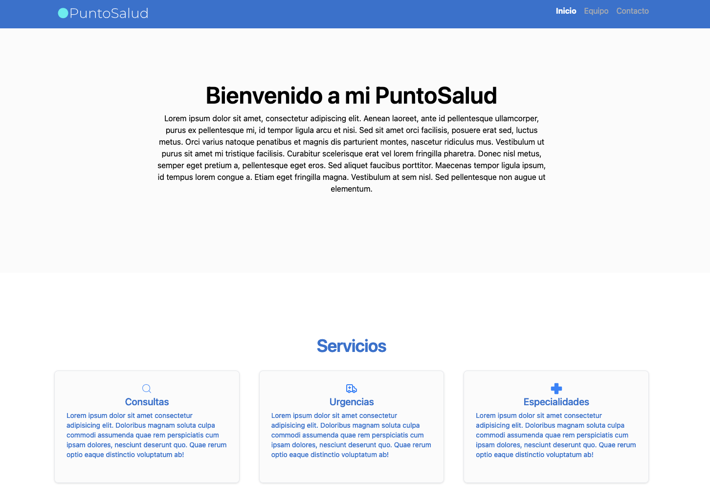

# Evaluacion Modulo 6 Ejercicio 2

## 📖 Descripción
En este ejercicio práctico, los estudiantes integrarán características básicas de una PWA
(Progressive Web Application) en el proyecto de la web del hospital. El objetivo es configurar
el archivo de manifiesto y registrar un Service Worker para mejorar la experiencia del
usuario, haciendo la aplicación instalable y accesible offline.



## 📁 Proyecto

```plaintext
/Modulo6E2
│
├── public
│   ├── assets
│   │   └── **.jpg/png/svg/ico
│   └── vite.svg
├── src
│   ├── App.jsx
│   ├── assets
│   │   └── react.svg
│   ├── components
│   │   ├── AppointmentForm.jsx
│   │   ├── BotonPrueba.jsx
│   │   ├── CitaConfirmada.jsx
│   │   ├── DoctorCard.jsx
│   │   ├── Footer.jsx
│   │   ├── Header.jsx
│   │   ├── ServiceList.jsx
│   │   ├── WithMoreInfo.jsx
│   │   ├── doctores.json
│   │   └── NavBar.jsx
│   ├── pages
│   │   ├── Contacto.jsx
│   │   ├── Equipo.jsx
│   │   └── Inicio.jsx
│   ├── index.css
│   └── main.jsx
├── README.md
├── eslint.config.js
├── index.html
├── package-lock.json
├── package.json
└── vite.config.js
```

### 📋 Prerrequisitos 

- Instalación de Node.js.
- Editor de texto (VS Code recomendado).

### 👁️ Instalación

Clona este repositorio en tu máquina local:

```bash
gh repo clone bastianorte/Modulo6E2
```

Navega hasta el directorio del proyecto:

```bash
cd Modulo6E2
```

Instala las dependencias:

```bash
npm install
```

Inicia el servidor de desarrollo:

```bash
npm run dev
```

Abre `http://localhost:5173` en tu navegador para visualizar la aplicación.


## 🔧 Tecnologías utilizadas

- **ReactJS** - Biblioteca principal para el desarrollo de la interfaz.
- **Vite** - Herramienta para empaquetado y servidor de desarrollo.
- **Tailwind** - Framework de estilos para diseño responsivo.
- **ReactIcons** - Libreria de iconos para React
- **ReactRouter** - Herramienta que gestiona la navegación entre diferentes vistas en React.

## :pencil2: Autor
Bastian Ortega Fuenzalida
 